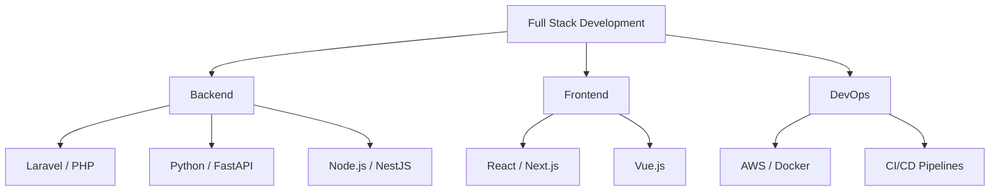

<!-- Custom Banner -->

  

  

  

---

## 🚀 **Professional Overview**

**Senior Full-Stack Developer** with over **10+ years of experience** building secure, scalable, and user-focused applications.

**Specializing in:** `Laravel` • `Python` • `Next.js` • `NestJS` — helping startups, SaaS platforms, and enterprise clients build modern digital products.

**Results-driven engineer** who transforms complex requirements into elegant, maintainable solutions.

---

## 🏆 **Achievements & Recognition**

| 🎯 **Award** | 📅 **Year** | 🏅 **Recognition** |
|:--:|:--:|:--:|
| **⭐ Star Performer Award** | 2022 | Excellence in Delivery |
| **🌟 Rising Star Award** | 2021 | Outstanding Growth |
| **🌙 KL Stars of the Month** | 2024 | Consistent Performance |

---

## 💼 **Core Expertise**

### **🎯 Languages**

### **⚡ Frameworks & Libraries**

### **🗄️ Databases**

### **☁️ DevOps & Cloud**

### **💳 Payment Integrations**

---

## 🎯 **What I Do**

### **💻 Backend Development**
- Laravel, Python (FastAPI, Flask), Node.js/NestJS
- REST APIs, webhooks, automation scripts
- Payment gateway integration (PayPal, Stripe, PayOP)

### **🎨 Frontend Development**
- React.js, Next.js, Vue.js
- Modern UI/UX, reusable components, optimized rendering

### **🗄️ Database Management**
- MySQL, PostgreSQL
- Query optimization, indexing, migrations

### **☁️ DevOps & Deployment**
- AWS, DigitalOcean, Docker
- CI/CD pipelines, server optimization

### **🔧 Other Capabilities**
- Third-party integrations (Google APIs, CRM, Telegram, WhatsApp)
- API architecture & documentation
- Web automation & scraping (Python + Playwright/Selenium)

---

## 📊 **GitHub Performance**

<!-- Dark/Light Theme Compatible Stats -->

  <picture>
    <source media="(prefers-color-scheme: dark)" srcset="https://github-readme-stats.vercel.app/api?username=rakeshmaity271&show_icons=true&theme=tokyonight&include_all_commits=true&count_private=true&border_radius=10&hide_border=true" />
    <source media="(prefers-color-scheme: light)" srcset="https://github-readme-stats.vercel.app/api?username=rakeshmaity271&show_icons=true&theme=default&include_all_commits=true&count_private=true&border_radius=10" />
    
  </picture>
  <picture>
    <source media="(prefers-color-scheme: dark)" srcset="https://github-readme-stats.vercel.app/api/top-langs/?username=rakeshmaity271&layout=compact&langs_count=8&theme=tokyonight&border_radius=10&hide_border=true" />
    <source media="(prefers-color-scheme: light)" srcset="https://github-readme-stats.vercel.app/api/top-langs/?username=rakeshmaity271&layout=compact&langs_count=8&theme=default&border_radius=10" />
    
  </picture>

  <picture>
    <source media="(prefers-color-scheme: dark)" srcset="https://github-readme-streak-stats.herokuapp.com/?user=rakeshmaity271&theme=tokyonight&border_radius=10&hide_border=true" />
    <source media="(prefers-color-scheme: light)" srcset="https://github-readme-streak-stats.herokuapp.com/?user=rakeshmaity271&theme=default&border_radius=10" />
    
  </picture>

  <picture>
    <source media="(prefers-color-scheme: dark)" srcset="https://github-readme-activity-graph.vercel.app/graph?username=rakeshmaity271&bg_color=1a1b27&color=38bdae&line=70a5fd&point=bf91f3&area=true&hide_border=true&border_radius=10" />
    <source media="(prefers-color-scheme: light)" srcset="https://github-readme-activity-graph.vercel.app/graph?username=rakeshmaity271&bg_color=ffffff&color=708090&line=24292e&point=24292e&area=true&hide_border=true&border_radius=10" />
    
  </picture>

---

## 📚 **Current Focus**

| 🎯 **Area** | 📝 **Description** |
|:--|:--|
| 🏗️ **System Design** | Deepening knowledge in scalable system architecture |
| 🤖 **AI Integrations** | Exploring advanced AI/ML implementations |
| 🛠️ **Developer Tools** | Building efficient tools and SaaS solutions |

---

## 🌟 **Why Work With Me?**

> **"Clean code, strong communication, and reliable delivery"**

- ✅ **10+ Years Experience** — Battle-tested across diverse projects and industries
- ✅ **Full Project Ownership** — From concept to deployment and beyond
- ✅ **Scalable Solutions** — Built to grow with your business
- ✅ **Strong Communication** — Clear updates, transparent timelines
- ✅ **Flexible Engagement** — Short-term, long-term, or full ownership

---

## 📞 **Let's Connect**

### **Open for Collaborations** 🚀

**Available for:** Project Development | Technical Consulting | Team Augmentation | Full Project Ownership

---

**💡 "Transforming ideas into scalable, production-ready applications"**

<!-- Snake Animation -->
<picture>
  <source media="(prefers-color-scheme: dark)" srcset="https://raw.githubusercontent.com/rakeshmaity271/rakeshmaity271/output/github-snake-dark.svg" />
  <source media="(prefers-color-scheme: light)" srcset="https://raw.githubusercontent.com/rakeshmaity271/rakeshmaity271/output/github-snake.svg" />
  
</picture>

<!-- Footer Wave -->

